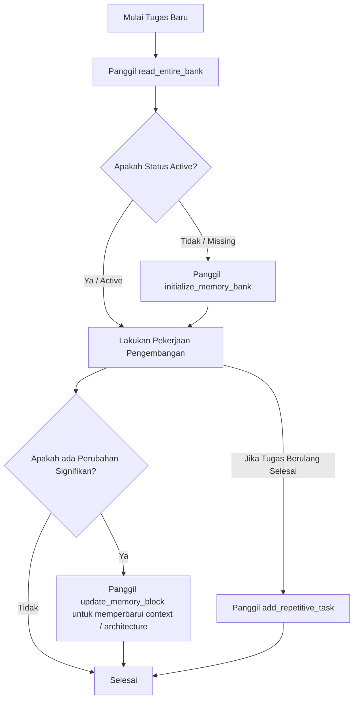

# VMAC - Virtual Memory Access

**VMAC** adalah server Model Context Protocol (MCP) yang mengimplementasikan sistem manajemen **Memory Bank** cerdas menggunakan database SQLite yang terisolasi secara dinamis di setiap root proyek target.

Sistem ini membantu AI mempertahankan memori jangka panjang, konteks pengerjaan fitur, serta Standar Operasional Prosedur (SOP) pengerjaan tugas berulang lintas sesi percakapan tanpa batas.

---

## 🚀 Fitur Utama

1. **Database Terisolasi per Proyek (Isolasi Dinamis):**
   Database SQLite (`mcp_memory_bank.db`) dibuat secara dinamis tepat di root proyek target. Tidak ada database global tunggal; memori proyek terisolasi penuh dan portabel.
2. **Sinkronisasi Berkas Fisik `.vmac`:**
   Perubahan SQLite di-write-through ke Markdown di `[root_path]/.vmac/rules/memory-bank/` (`brief.md`, `product.md`, `context.md`, `architecture.md`, `tech.md`, `tasks.md`). Core files sinkron dua arah: jika `.md` lebih baru (mtime) dari `updated_at` DB, `read_entire_bank` mengimpor file ke SQLite. `tasks.md` hanya DB→file (kompilasi).
3. **Pemindaian Proyek Cerdas (Smart Auto-Scanning):**
   Saat inisialisasi, server memindai struktur proyek untuk menyusun `tech` dan `architecture` awal.
4. **Proteksi Berkas `brief.md`:**
   Tool menolak update otomatis `brief`; edit manual via file + import on read.
5. **Kompilasi SOP Otomatis (`tasks.md`):**
   SOP di tabel `tasks` dikompilasi ke `.vmac/rules/memory-bank/tasks.md`.

---

## Edit manual `.vmac` → SQLite

Lokasi mirror: `[root_path]/.vmac/rules/memory-bank/`

| File | Arah sync | Edit manual? |
|---|---|---|
| `brief.md`, `product.md`, `context.md`, `architecture.md`, `tech.md` | Dua arah (mtime file menang) | Ya → masuk DB saat `read_entire_bank` |
| `tasks.md` | Satu arah DB→file | Tidak. Pakai tool task (`add_repetitive_task` / `update_task`) |

### Aturan mtime
- Pemicu: **hanya** saat `read_entire_bank` (bukan file watcher real-time).
- Import jika: file ada **dan** `mtime_file > updated_at_DB + 1s` **dan** isi berbeda → upsert ke `memory_core`.
- Export jika: file hilang, baris DB ada → tulis ulang `.md` dari DB.
- Auto-heal: project hilang di DB tapi folder `.vmac` ada → import core dari file.

### Langkah edit core
1. Ubah salah satu core `.md` di atas (contoh `context.md`).
2. Panggil `read_entire_bank(root_path)`.
3. Isi file yang lebih baru diimpor ke SQLite; output tool memuat teks hasil edit.

### Yang tidak di-sync balik
- Edit manual `tasks.md` **tidak** masuk tabel `tasks`.
- Tidak ada debounce/polling background; tanpa `read_entire_bank`, DB tetap isi lama.

---

## 🛠️ Persyaratan Sistem

- **Python:** versi `>= 3.10`
- **uv:** versi terbaru (untuk kemudahan eksekusi paket instan via `uvx`)

---

## 📦 Cara Penggunaan Instan via `uvx`

Anda tidak perlu melakukan instalasi manual secara lokal! Berkat dukungan metadata `pyproject.toml`, server MCP ini dapat langsung dieksekusi secara instan dari repositori GitHub menggunakan `uvx`:

```bash
uvx --from git+https://github.com/vfh-tech/vmac.git vmac
```

---

## 🤖 Konfigurasi Integrasi Claude Code

Untuk menggunakan server MCP ini di **Claude Code**, Anda cukup menambahkan konfigurasi server ke berkas `.mcp.json` di root proyek Anda atau secara global.

### Langkah 1: Buat/Perbarui Berkas `.mcp.json`
Buat berkas `.mcp.json` di root proyek Anda dan masukkan konfigurasi berikut:

```json
{
  "mcpServers": {
    "vmac": {
      "command": "uvx",
      "args": [
        "--from",
        "git+https://github.com/vfh-tech/vmac.git",
        "vmac"
      ]
    }
  }
}
```

### Langkah 2: Jalankan Claude Code
Saat Anda menjalankan Claude Code di direktori proyek tersebut, Claude Code akan secara otomatis membaca berkas `.mcp.json` lokal ini, mengunduh rilis `vmac` terbaru via `uvx`, dan mengaktifkan seluruh tool Memory Bank secara instan!

---

## 🖥️ Konfigurasi Claude Desktop (Opsional)

Jika Anda ingin menggunakannya di aplikasi **Claude Desktop App**, tambahkan konfigurasi berikut ke berkas pengaturan konfigurasi Anda (`~/.config/Claude/claude_desktop_config.json` pada Linux/macOS atau `%APPDATA%\Claude\claude_desktop_config.json` pada Windows):

```json
{
  "mcpServers": {
    "vmac": {
      "command": "uvx",
      "args": [
        "--from",
        "git+https://github.com/vfh-tech/vmac.git",
        "vmac"
      ]
    }
  }
}
```

---

## 📋 Daftar Tool MCP yang Tersedia

### Core memory

#### 1. `initialize_memory_bank`
Inisialisasi / re-init Memory Bank di root proyek. First-run: buat DB + 5 core + mirror `.vmac`. Re-init: **tidak menimpa** core yang sudah diisi user; hanya pastikan skema/DB/mirror ada dan update `project_name`.
- **Argumen:**
  - `project_name` (string, required)
  - `root_path` (string, required)
  - `initial_analysis` (string, optional) — hanya diterapkan ke `architecture` pada **first-run**

#### 2. `read_entire_bank`
Baca seluruh core dari SQLite + **sync mtime `.vmac` (file menang)**. Setelah edit manual core `.md`, panggil tool ini agar isi masuk SQLite. Auto-heal jika DB kosong / project hilang tapi `.vmac` ada.
- **Argumen:** `root_path` (required)
- **Efek samping sync:** `import:<file_type>` jika mtime file menang; `export:<file_type>` jika mirror hilang

#### 3. `update_memory_block`
Update satu blok core (`product` | `context` | `architecture` | `tech`). `brief` diblokir.
- **Argumen:**
  - `root_path` (required)
  - `file_type` (required)
  - `new_content` (required) — full replace (default) atau body section jika `mode=patch`
  - `mode` (optional, default `replace`): `replace` | `patch`
  - `section` (optional): heading Markdown level-2 (`## Nama`) yang diganti saat `mode=patch`

#### 4. `export_memory_to_md`
Export seluruh memory ke folder Markdown.
- **Argumen:** `root_path` (required), `output_dir` (optional, default `.vmac/export/`)

#### 5. `search_memory`
Cari keyword di `memory_core` + `tasks`.
- **Argumen:** `root_path` (required), `keyword` (required)

### Tasks (SOP)

#### 6. `add_repetitive_task`
Simpan SOP baru.
- **Argumen:** `root_path`, `task_name`, `description`, `steps` (required); `files_to_modify`, `gotchas` (optional)

#### 7. `update_task`
Update / rename SOP.
- **Argumen:** `root_path`, `task_name`, `description`, `steps` (required); `files_to_modify`, `gotchas`, `new_task_name` (optional)

#### 8. `delete_repetitive_task`
Hapus SOP.
- **Argumen:** `root_path`, `task_name`

#### 9. `read_task`
Detail satu SOP.
- **Argumen:** `root_path`, `task_name`

#### 10. `log_task_execution`
Catat eksekusi SOP + update `last_performed`.
- **Argumen:** `root_path`, `task_name`; `result_summary` (optional)

#### 11. `list_task_history`
Riwayat log (max 50).
- **Argumen:** `root_path`; `task_name` (optional)

### Ops

#### 12. `memory_bank_health`
Cek kesehatan bank (read-only): status `ok` | `degraded` | `missing`, kelengkapan core DB/md, jumlah tasks.
- **Argumen:** `root_path` (required)

---

## 🔄 Alur Kerja Siklus Pengembangan (Workflows)



1. **Awal Tugas:** AI wajib menjalankan `read_entire_bank` untuk menyerap status terakhir **dan** mengimpor edit manual core `.md` (mtime file menang).
2. **Saat Menghadapi Fitur Berulang:** AI mendeteksi apakah SOP sudah ada di tabel `tasks` (bukan dari edit `tasks.md`) lalu mengikutinya.
3. **Akhir Tugas:** AI memperbarui `context` via `update_memory_block` (write-through ke `.md`). Alternatif: edit manual core `.md` lalu `read_entire_bank` di sesi berikutnya.
4. **Edit manual core:** boleh; selalu diikuti `read_entire_bank`. **Edit manual `tasks.md`:** diabaikan untuk DB — gunakan tool task.
