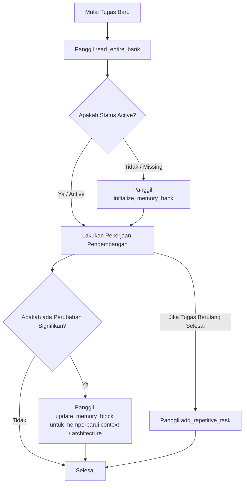

# VMAC - MCP Memory Bank Server (SQLite & .vmac)

**VMAC** adalah server Model Context Protocol (MCP) yang mengimplementasikan sistem manajemen **Memory Bank** cerdas menggunakan database relasional SQLite yang terisolasi secara dinamis di setiap root proyek target, dikombinasikan dengan sinkronisasi dua arah berkas Markdown fisik secara otomatis pada folder `.vmac/rules/memory-bank/`.

Sistem ini membantu AI mempertahankan memori jangka panjang, konteks pengerjaan fitur, serta Standar Operasional Prosedur (SOP) pengerjaan tugas berulang lintas sesi percakapan tanpa batas.

---

## 🚀 Fitur Utama

1. **Database Terisolasi per Proyek (Isolasi Dinamis):**
   Database SQLite (`mcp_memory_bank.db`) dibuat secara dinamis tepat di root proyek target yang Anda tunjuk. Tidak ada database global tunggal; semua riwayat memori proyek terisolasi penuh dan bersifat portabel.
2. **Sinkronisasi Berkas Fisik `.vmac`:**
   Setiap perubahan pada SQLite disinkronkan secara real-time ke berkas Markdown lokal di dalam direktori `[root_path]/.vmac/rules/memory-bank/` (`brief.md`, `product.md`, `context.md`, `architecture.md`, `tech.md`, `tasks.md`).
3. **Pemindaian Proyek Cerdas (Smart Auto-Scanning):**
   Saat inisialisasi awal dijalankan, server akan memindai struktur proyek secara cerdas guna mendeteksi bahasa pemrograman, ekosistem/framework, konfigurasi utama, dan struktur direktori proyek nyata untuk menyusun dokumen `tech.md` dan `architecture.md` awal secara akurat.
4. **Proteksi Berkas `brief.md`:**
   Server secara terprogram menolak pembaruan otomatis untuk berkas `brief.md` guna mencegah AI merusak batasan ruang lingkup (*scope*) awal proyek yang seharusnya hanya didefinisikan secara manual oleh developer.
5. **Kompilasi SOP Otomatis (`tasks.md`):**
   Mendokumentasikan instruksi kerja repetitif secara otomatis ke dalam dokumen `tasks.md` terstruktur langsung dari basis data.

---

## 🛠️ Persyaratan Sistem

- **Python:** versi `>= 3.10`
- **uv:** versi terbaru (untuk kemudahan eksekusi paket instan via `uvx`)

---

## 📦 Cara Penggunaan Instan via `uvx`

Anda tidak perlu melakukan instalasi manual secara lokal! Berkat dukungan metadata `pyproject.toml`, server MCP ini dapat langsung dieksekusi secara instan dari repositori GitHub menggunakan `uvx`:

```bash
uvx --from git+https://github.com/vfh-tech/vmac.git vmac
```

---

## 🤖 Konfigurasi Integrasi Claude Code

Untuk menggunakan server MCP ini di **Claude Code**, Anda cukup menambahkan konfigurasi server ke berkas `.mcp.json` di root proyek Anda atau secara global.

### Langkah 1: Buat/Perbarui Berkas `.mcp.json`
Buat berkas `.mcp.json` di root proyek Anda dan masukkan konfigurasi berikut:

```json
{
  "mcpServers": {
    "vmac": {
      "command": "uvx",
      "args": [
        "--from",
        "git+https://github.com/vfh-tech/vmac.git",
        "vmac"
      ]
    }
  }
}
```

### Langkah 2: Jalankan Claude Code
Saat Anda menjalankan Claude Code di direktori proyek tersebut, Claude Code akan secara otomatis membaca berkas `.mcp.json` lokal ini, mengunduh rilis `vmac` terbaru via `uvx`, dan mengaktifkan seluruh tool Memory Bank secara instan!

---

## 🖥️ Konfigurasi Claude Desktop (Opsional)

Jika Anda ingin menggunakannya di aplikasi **Claude Desktop App**, tambahkan konfigurasi berikut ke berkas pengaturan konfigurasi Anda (`~/.config/Claude/claude_desktop_config.json` pada Linux/macOS atau `%APPDATA%\Claude\claude_desktop_config.json` pada Windows):

```json
{
  "mcpServers": {
    "vmac": {
      "command": "uvx",
      "args": [
        "--from",
        "git+https://github.com/vfh-tech/vmac.git",
        "vmac"
      ]
    }
  }
}
```

---

## 📋 Daftar Tool MCP yang Tersedia

### 1. `initialize_memory_bank`
Inisialisasi sistem Memory Bank di proyek baru. Membuat direktori `.vmac`, menjalankan pemindaian proyek, dan membuat database SQLite di root proyek.
- **Argumen:**
  - `project_name` (string, required): Nama proyek Anda.
  - `root_path` (string, required): Jalur absolut direktori root proyek.
  - `initial_analysis` (string, optional): Catatan analisis tambahan dari arsitektur.

### 2. `read_entire_bank`
Membaca seluruh isi Memory Bank fisik dan SQLite untuk memulihkan seluruh konteks memori AI di awal tugas. Memiliki kemampuan *auto-healing import* jika database SQLite baru dibuat tetapi folder fisik `.vmac` sudah ada.
- **Argumen:**
  - `root_path` (string, required): Jalur absolut direktori root proyek.

### 3. `update_memory_block`
Memperbarui satu blok file core tertentu secara sinkron baik di database SQLite maupun berkas Markdown lokal.
- **Argumen:**
  - `root_path` (string, required): Jalur absolut direktori root proyek.
  - `file_type` (string, required): Salah satu dari `product`, `context`, `architecture`, `tech` (*Tipe `brief` diblokir otomatis*).
  - `new_content` (string, required): Konten Markdown baru.

### 4. `add_repetitive_task`
Menyimpan Standar Operasional Prosedur (SOP) untuk pekerjaan berulang ke database SQLite dan menghasilkan dokumen visual terstruktur di `.vmac/rules/memory-bank/tasks.md`.
- **Argumen:**
  - `root_path` (string, required): Jalur absolut direktori root proyek.
  - `task_name` (string, required): Nama tugas (misal: "Tambah Model AI Baru").
  - `description` (string, required): Kegunaan prosedur.
  - `steps` (string, required): Langkah-langkah detail.
  - `files_to_modify` (string, optional): Daftar berkas yang perlu diubah.
  - `gotchas` (string, optional): Catatan kritis yang harus diperhatikan.

---

## 🔄 Alur Kerja Siklus Pengembangan (Workflows)



1. **Awal Tugas:** AI wajib menjalankan `read_entire_bank` untuk menyerap status pengerjaan terakhir secara akurat.
2. **Saat Menghadapi Fitur Berulang:** AI mendeteksi apakah SOP tugas tersebut sudah terdaftar di `tasks.md` dan mengikutinya agar terhindar dari kesalahan yang pernah terjadi sebelumnya.
3. **Akhir Tugas:** AI memperbarui `context.md` menggunakan `update_memory_block` untuk mendokumentasikan langkah yang telah selesai dan rencana tugas berikutnya lintas sesi.
