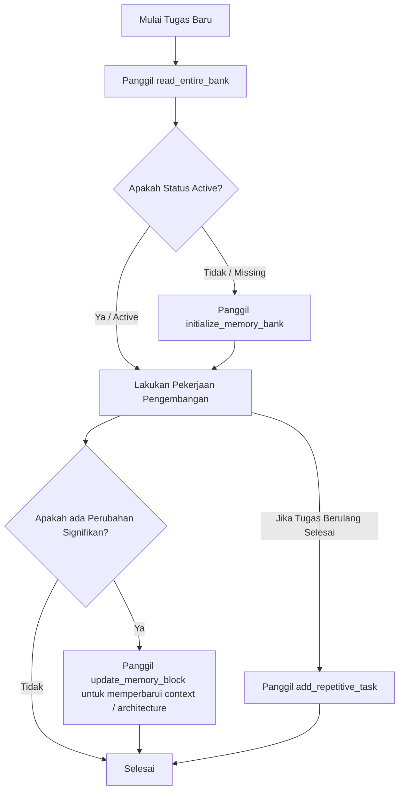

# VMAC - Virtual Memory Access

**VMAC** adalah server Model Context Protocol (MCP) yang mengimplementasikan sistem manajemen **Memory Bank** cerdas menggunakan database SQLite yang terisolasi secara dinamis di setiap root proyek target.

Sistem ini membantu AI mempertahankan memori jangka panjang, konteks pengerjaan fitur, serta Standar Operasional Prosedur (SOP) pengerjaan tugas berulang lintas sesi percakapan tanpa batas.

---

## 🚀 Fitur Utama

1. **Database Terisolasi per Proyek (Isolasi Dinamis):**
   Database SQLite (`mcp_memory_bank.db`) dibuat secara dinamis tepat di root proyek target. Tidak ada database global tunggal; memori proyek terisolasi penuh dan portabel.
2. **Sinkronisasi Berkas Fisik `.vmac`:**
   Perubahan SQLite di-write-through ke Markdown di `[root_path]/.vmac/rules/memory-bank/` (`brief.md`, `product.md`, `context.md`, `architecture.md`, `tech.md`, `tasks.md`). Core files sinkron dua arah: jika `.md` lebih baru (mtime) dari `updated_at` DB, `read_entire_bank` mengimpor file ke SQLite. `tasks.md` hanya DB→file (kompilasi).
3. **Pemindaian Proyek Cerdas (Smart Auto-Scanning):**
   Saat inisialisasi, server memindai struktur proyek untuk menyusun `tech` dan `architecture` awal.
4. **Proteksi Berkas `brief.md`:**
   Tool menolak update otomatis `brief`; edit manual via file + import on read.
5. **Kompilasi SOP Otomatis (`tasks.md`):**
   SOP di tabel `tasks` dikompilasi ke `.vmac/rules/memory-bank/tasks.md`.

---

## 🛠️ Persyaratan Sistem

- **Python:** versi `>= 3.10`
- **uv:** versi terbaru (untuk kemudahan eksekusi paket instan via `uvx`)

---

## 📦 Cara Penggunaan Instan via `uvx`

Anda tidak perlu melakukan instalasi manual secara lokal! Berkat dukungan metadata `pyproject.toml`, server MCP ini dapat langsung dieksekusi secara instan dari repositori GitHub menggunakan `uvx`:

```bash
uvx --from git+https://github.com/vfh-tech/vmac.git vmac
```

---

## 🤖 Konfigurasi Integrasi Claude Code

Untuk menggunakan server MCP ini di **Claude Code**, Anda cukup menambahkan konfigurasi server ke berkas `.mcp.json` di root proyek Anda atau secara global.

### Langkah 1: Buat/Perbarui Berkas `.mcp.json`
Buat berkas `.mcp.json` di root proyek Anda dan masukkan konfigurasi berikut:

```json
{
  "mcpServers": {
    "vmac": {
      "command": "uvx",
      "args": [
        "--from",
        "git+https://github.com/vfh-tech/vmac.git",
        "vmac"
      ]
    }
  }
}
```

### Langkah 2: Jalankan Claude Code
Saat Anda menjalankan Claude Code di direktori proyek tersebut, Claude Code akan secara otomatis membaca berkas `.mcp.json` lokal ini, mengunduh rilis `vmac` terbaru via `uvx`, dan mengaktifkan seluruh tool Memory Bank secara instan!

---

## 🖥️ Konfigurasi Claude Desktop (Opsional)

Jika Anda ingin menggunakannya di aplikasi **Claude Desktop App**, tambahkan konfigurasi berikut ke berkas pengaturan konfigurasi Anda (`~/.config/Claude/claude_desktop_config.json` pada Linux/macOS atau `%APPDATA%\Claude\claude_desktop_config.json` pada Windows):

```json
{
  "mcpServers": {
    "vmac": {
      "command": "uvx",
      "args": [
        "--from",
        "git+https://github.com/vfh-tech/vmac.git",
        "vmac"
      ]
    }
  }
}
```

---

## 📋 Daftar Tool MCP yang Tersedia

### 1. `initialize_memory_bank`
Inisialisasi sistem Memory Bank di proyek baru. Menjalankan pemindaian proyek dan membuat database SQLite di root proyek.
- **Argumen:**
  - `project_name` (string, required): Nama proyek Anda.
  - `root_path` (string, required): Jalur absolut direktori root proyek.
  - `initial_analysis` (string, optional): Catatan analisis tambahan dari arsitektur.

### 2. `read_entire_bank`
Membaca seluruh isi Memory Bank dari SQLite untuk memulihkan konteks memori AI di awal tugas.
- **Argumen:**
  - `root_path` (string, required): Jalur absolut direktori root proyek.

### 3. `update_memory_block`
Memperbarui satu blok memory core tertentu di database SQLite.
- **Argumen:**
  - `root_path` (string, required): Jalur absolut direktori root proyek.
  - `file_type` (string, required): Salah satu dari `product`, `context`, `architecture`, `tech` (*Tipe `brief` diblokir otomatis*).
  - `new_content` (string, required): Konten Markdown baru.

### 4. `add_repetitive_task`
Menyimpan Standar Operasional Prosedur (SOP) untuk pekerjaan berulang ke tabel `tasks` di database SQLite.
- **Argumen:**
  - `root_path` (string, required): Jalur absolut direktori root proyek.
  - `task_name` (string, required): Nama tugas (misal: "Tambah Model AI Baru").
  - `description` (string, required): Kegunaan prosedur.
  - `steps` (string, required): Langkah-langkah detail.
  - `files_to_modify` (string, optional): Daftar berkas yang perlu diubah.
  - `gotchas` (string, optional): Catatan kritis yang harus diperhatikan.

### 5. `read_task`
Membaca detail lengkap satu SOP dari tabel `tasks`, termasuk steps, files_to_modify, dan gotchas.
- **Argumen:**
  - `root_path` (string, required): Jalur absolut direktori root proyek.
  - `task_name` (string, required): Nama task yang ingin dibaca detailnya.

---

## 🔄 Alur Kerja Siklus Pengembangan (Workflows)



1. **Awal Tugas:** AI wajib menjalankan `read_entire_bank` untuk menyerap status pengerjaan terakhir secara akurat.
2. **Saat Menghadapi Fitur Berulang:** AI mendeteksi apakah SOP tugas tersebut sudah terdaftar di tabel tasks SQLite dan mengikutinya agar terhindar dari kesalahan yang pernah terjadi sebelumnya.
3. **Akhir Tugas:** AI memperbarui blok context di SQLite menggunakan `update_memory_block` untuk mendokumentasikan langkah yang telah selesai dan rencana tugas berikutnya lintas sesi.
